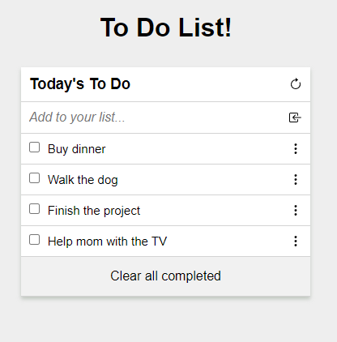

# To Do List

It is a basic To Do List on which the user can add small task to be completed in the future.

### Preview

## Live DEMO

[Check a live demo](https://orozcoding.github.io/todolist/);

## Built With

- HTML
- CSS
- JavaScript

## Getting Started

- Install Node.js
- Install text editor of your choice (eg. VS Code)
- Clone the repository from [here](https://github.com/orozCoding/todolist)
- On the root directory, run 'npm install' on the terminal to install packages.
- Run 'npm start' on the terminal to start live server.

## Authors

👤 **Angel Orozco**

- GitHub: [@githubhandle](https://github.com/orozCoding)
- LinkedIn: [LinkedIn](https://www.linkedin.com/in/angel-orozco-652230228/)

## 🤝 Contributing

Contributions, issues, and feature requests are welcome!

Feel free to check the [issues page](../../issues/).

## Show your support

Give a ⭐️ if you like this project!

## Acknowledgments

- [Microverse Inc](https://www.microverse.org/)

## 📝 License

This project is [MIT](./MIT.md) licensed.
